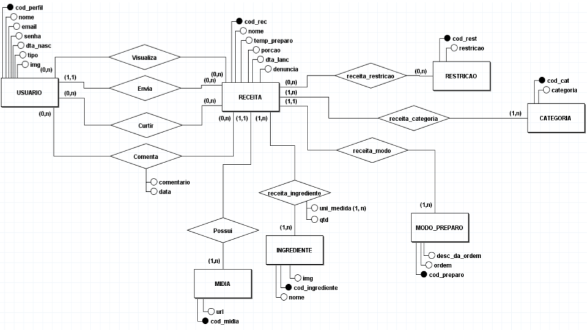

# SISTEMA CHEF EM CASA
Trabalho desenvolvido durante a disciplina de Banco de Dados do Integrado

# Sumário

### 1. COMPONENTES 
Integrantes do grupo 
Halisson Julio Lopes:email_primeiro_componente@dominio.com 
Paulo Victor:paulovictoralves.contato@gmail.com 
Pedro Antônio:naosei@gmail.com 
Ricardo Leite Rodrigues:ricardoleiterodriguesbe@gmail.com 

### 2.MINIMUNDO 

> Você já teve dificuldades em achar receitas com os ingredientes que possui em casa? Já desistiu de cozinhar por causa disto? Gostaria de uma ferramenta que ajudasse a encontrar receitas com os ingredientes disponíveis?
Nosso sistema proporciona uma forma de resolver estas questões, possuindo também uma interface agradável, que possibilita mostrar receitas de acordo com suas necessidades. 
O sistema conterá informações sobre os usuários, receitas, 
O usuário terá que registrar um nome, um email, uma senha e uma data de nascimento, além disso ele terá um código no sistema que o identifica, ele poderá enviar receitas, bem como pesquisar, avaliar, favoritar e comentar em outras receitas.
Para cadastrar uma receita o usuário deverá preencher um nome,  um tempo de preparo, seu rendimento e  sua dificuldade, ao criar a receita ela receberá um código que a identifica no sistema. A receita pode conter um ou mais ingredientes.
Os ingredientes são gerais para todas as receitas e terão um código no sistema e o nome deles e poderão ser registrados no sistema.
Assim como os ingredientes, as restrições alimentícias terão um código no sistema e um nome, mas não poderão ser registradas no sistema.
Cada receita pode conter um ou vários ingredientes, porém pode ter nenhuma ou várias restrições.

### 3.PMC 
a) inclusão do PMC desenvolvido pelo grupo  

#### 3.1. EAP - Estrutura Analítica do Projeto
a) Incluír imagem da EAP   
b) Dicinário da EAP      

#### 3.2. Requisitos funcionais e não funcionais
  
     

#### 3.3 Validação da Ideia.
a) Link do formulário desenvolvido 
b) Link para Relatório/Apresentação de resultados obtidos

### 4.Personas e Histórias de usuário 
a) inclusão dos Persons desenvolvidos pelo grupo 
1-  
Chef Profissional  
Nome: Ana Silva  
Idade: 35 anos  
Profissão: Chef de cozinha  
Descrição: Ana é uma chef profissional renomada, com anos de experiência em culinária gourmet. Ela está sempre buscando novas receitas e técnicas culinárias para aprimorar suas habilidades. Ana precisa de um site que acelere uma ampla variedade de receitas sofisticadas, ingredientes de alta qualidade e instruções específicas para aprendê-la a criar pratos inovadores. 

2- 
Estudante Universitária  
Nome: Marina Oliveira  
Idade: 20 anos  
Profissão: Estudante universitária  
Descrição: Marina é uma estudante universitária ocupada, que está constantemente equilibrando seus estudos com outras responsabilidades. Ela precisa de receitas rápidas e acessíveis, que podem ser preparadas com ingredientes simples e disponíveis em um orçamento limitado. Marina está em busca de um site de receitas que gosta de opções saudáveis e práticas para o seu estilo de vida agitado. 
 
b) inclusão das Histórias de usuário desenvolvidas pelo grupo 
1- 
História de usuário: Como uma chef profissional, Ana precisa acessar um site de receitas que seja confiável e inspirada para seus pratos gourmet. Ela deseja encontrar receitas exclusivas, com ingredientes de alta qualidade e técnicas avançadas. Ana também procura por um site que possua uma comunidade ativa, onde ela possa compartilhar suas criações e trocar ideias com outros chefs. 
 
2- 
História de usuário: Marina tem uma vida movimentada devido aos seus estudos e atividades extracurriculares. Ela precisa de um site de receitas que dê opções rápidas e fáceis de preparar, para que possa se alimentar de forma saudável mesmo com pouco tempo disponível. Marina também gostaria de encontrar dicas de refeições para emagrecer e sugestões para aproveitar ao máximo os ingredientes básicos que ela tem em casa. 

 

### 5. PROTÓTIPOS DO SISTEMA 
Neste ponto a codificação não e necessária, somente as ideias de telas devem ser desenvolvidas. O princípio aqui é pensar na criação da interface para identificar possíveis informações a serem armazenadas e/ou descartadas  

Sugestão: https://balsamiq.com/products/mockups/ 

#### 5.1 PROTÓTIPO DO SISTEMA MOBILE  
https://app.quant-ux.com/#/test.html?h=a2aa10aJ9AiqXUmfxAqY1GRvdOALyFry8XEWzhL4Phs213oDw0fw1E5Q4Ree&ln=en 
#### 5.2 PROTÓTIPO DO SISTEMA WEB 

#### 5.3 QUAIS PERGUNTAS PODEM SER RESPONDIDAS COM OS SISTEMA WEB/MOBILE PROPOSTOS?
    
> A Empresa Chef em Casa precisa inicialmente dos seguintes relatórios:
* Relatório de quais são as receitas mais bem avaliadas pelos usuários.
* Receitas com filtros escolhidos pelos usuários (pelas restrições ou pelas categorias).
* Relatório sobre o perfil do usuário (quantidade de curtidas ele tem em suas receitas).
* Relátório dos 5 ingredientes mais utilizados.
* Relatório dos usuarios e quantas receitas eles mandaram.

 ### 6.MODELO CONCEITUAL 
  

      
    
#### 7 Descrição dos dados   
PERFIL: Tabela que armazena as informações relativas ao perfil 
cod_perfil: campo que armazena o número de registro do perfil no banco. 
nome: campo que armazena o nome do perfil. 
email: campo que armazena o email do perfil. 
senha: campo que armazena a senha do perfil. 
dta_nasc: campo que armazena a data de nascimento do perfil. 
tipo: campo que armazena o tipo do perfil. 
img: campo que armazena a URL da foto do perfil. 
 
RECEITA: Tabela que armazena as informações das receitas 
cod_rec: campo que armazena o número de registro da receita no banco. 
nome: campo que armazena o nome da receita. 
temp_preparo: campo que armazena o tempo de preparo (em minutos) da receita. 
porcao: campo que armazena a quantidade de pessoas que dá para alimentar. 
dta_lanc: campo que armazena a data de lançamento da receita. 
denuncia: campo que armazena a quantidade de denúncias que a receita levou. 
 
RESTRICAO: Tabela que armazena as informações das restrições 
cod_rest: campo que armazena o número de registro da restrição no banco. 
restricao: informa qual a restrição. 
 
CATEGORIA: Tabela que armazena as informações das categorias 
cod_cat: campo que armazena o número de registro da categoria no banco. 
restricao: informa qual a categoria. 
 
INGREDIENTE: Tabela que armazena as informações relativas aos ingredientes 
cod_ingrediente: campo que armazena o número de registro do ingrediente no banco. 
nome: informa qual é o ingrediente. 
img: campo que armazena a URL da foto do ingrediente. 
 
MODO_PREPARO: Tabela que armazena as informações do modo de preparo da Receita 
cod_preparo: campo que armazena o número de registro do modo de preparo no banco. 
ordem: campo que armazena o número do passo, ex: 1- 
desc_da_ordem: campo que armazena a descrição da ordem, ex: faça isso 
 
MIDIA: Tabela que armazena as fotos da receita 
cod_midia: Campo que armazena o número de cada mídia. 
url: Campo que guarda o endereço da imagem. 
 

### 8	RASTREABILIDADE DOS ARTEFATOS 
        a) Historia de usuários vs protótipo (Histórias de Usuário e em qual tela do protótipo aquela HU está sendo realizada). 
	
1- Tela principal, onde aparece as novas receitas, mas também no filtro, já que ela deseja certas receitas gourmet  
2- A tela do filtro, filtrando as receitas por saudáveis e rápidas, pela sua vida agitada de universitária  
 
	
        b) Protótipo vs Modelo conceitual (Histórias de Usuário e em quais tabelas aquele dado está sendo registrado). 
        (modelos devem obrigatoriamente estar em conformidade de rastreabilidade) 
	
Ambas estão na relação da tabela receita e categoria.

### 9	MODELO LÓGICO 

### 10	MODELO FÍSICO 
        a) inclusão das instruções de criacão das estruturas em SQL/DDL 
        (criação de tabelas, alterações, etc..) 
	
CREATE TABLE USUARIO (
    cod_perfil SERIAL PRIMARY KEY,
    nome VARCHAR(100),    
    email VARCHAR(80),
    senha VARCHAR(30),
    dta_nasc DATE,
    tipo VARCHAR(20),
    img VARCHAR(255)
);

CREATE TABLE RESTRICAO (
    cod_rest SERIAL PRIMARY KEY,
    restricao VARCHAR(50)
);

CREATE TABLE RECEITA (
    cod_rec SERIAL PRIMARY KEY,
    nome VARCHAR(100),
    temp_preparo INTEGER,
    porcao INTEGER,
    dta_lanc DATE,
    denuncia VARCHAR(15),
    FK_USUARIO_cod_perfil INTEGER
);

CREATE TABLE INGREDIENTE (
    cod_ingrediente SERIAL PRIMARY KEY,
    nome VARCHAR(50),
    img VARCHAR(255)
);

CREATE TABLE MODO_PREPARO (
    cod_preparo SERIAL PRIMARY KEY,
    ordem INTEGER,
    desc_da_ordem VARCHAR(255),
    FK_RECEITA_cod_rec INTEGER
);

CREATE TABLE CATEGORIA (
    cod_cat SERIAL PRIMARY KEY,
    categoria VARCHAR(50)
);

CREATE TABLE MIDIA (
    cod_midia SERIAL PRIMARY KEY,
    url VARCHAR(255),
    FK_RECEITA_cod_rec INTEGER
);

CREATE TABLE receita_restricao (
    fk_RECEITA_cod_rec INTEGER,
    fk_RESTRICAO_cod_rest INTEGER
);

CREATE TABLE receita_ingrediente (
    fk_RECEITA_cod_rec INTEGER,
    fk_INGREDIENTE_cod_ingrediente INTEGER,
    fk_MEDIDA_cod_medida_ INTEGER,
    qtd INTEGER
);

CREATE TABLE MEDIDA (
    cod_medida SERIAL NOT NULL PRIMARY KEY,
    medida varchar(80)
);

CREATE TABLE Comenta (
    fk_USUARIO_cod_perfil INTEGER,
    fk_RECEITA_cod_rec INTEGER,
    comentario VARCHAR(255),
    data DATE
);

CREATE TABLE Curtir (
    fk_USUARIO_cod_perfil INTEGER,
    fk_RECEITA_cod_rec INTEGER
);

CREATE TABLE receita_categoria (
    fk_RECEITA_cod_rec INTEGER,
    fk_CATEGORIA_cod_cat INTEGER
);

CREATE TABLE Visualiza (
    fk_USUARIO_cod_perfil INTEGER,
    fk_RECEITA_cod_rec INTEGER
);
 
ALTER TABLE RECEITA ADD CONSTRAINT FK_RECEITA_2
    FOREIGN KEY (FK_USUARIO_cod_perfil)
    REFERENCES USUARIO (cod_perfil)
    ON DELETE CASCADE;
 
ALTER TABLE MODO_PREPARO ADD CONSTRAINT FK_MODO_PREPARO_2
    FOREIGN KEY (FK_RECEITA_cod_rec)
    REFERENCES RECEITA (cod_rec)
    ON DELETE RESTRICT;
 
ALTER TABLE MIDIA ADD CONSTRAINT FK_MIDIA_2
    FOREIGN KEY (FK_RECEITA_cod_rec)
    REFERENCES RECEITA (cod_rec)
    ON DELETE RESTRICT;
 
ALTER TABLE receita_restricao ADD CONSTRAINT FK_receita_restricao_1
    FOREIGN KEY (fk_RECEITA_cod_rec)
    REFERENCES RECEITA (cod_rec)
    ON DELETE SET NULL;
 
ALTER TABLE receita_restricao ADD CONSTRAINT FK_receita_restricao_2
    FOREIGN KEY (fk_RESTRICAO_cod_rest)
    REFERENCES RESTRICAO (cod_rest)
    ON DELETE SET NULL;
 
ALTER TABLE receita_ingrediente ADD CONSTRAINT FK_receita_ingrediente_1
    FOREIGN KEY (fk_RECEITA_cod_rec)
    REFERENCES RECEITA (cod_rec)
    ON DELETE RESTRICT;
 
ALTER TABLE receita_ingrediente ADD CONSTRAINT FK_receita_ingrediente_2
    FOREIGN KEY (fk_INGREDIENTE_cod_ingrediente)
    REFERENCES INGREDIENTE (cod_ingrediente)
    ON DELETE RESTRICT;
 
ALTER TABLE receita_ingrediente ADD CONSTRAINT FK_receita_ingrediente_3
    FOREIGN KEY (fk_MEDIDA_cod_medida_)
    REFERENCES MEDIDA (cod_medida)
    ON DELETE NO ACTION;
 
ALTER TABLE Comenta ADD CONSTRAINT FK_Comenta_1
    FOREIGN KEY (fk_USUARIO_cod_perfil)
    REFERENCES USUARIO (cod_perfil)
    ON DELETE SET NULL;
 
ALTER TABLE Comenta ADD CONSTRAINT FK_Comenta_2
    FOREIGN KEY (fk_RECEITA_cod_rec)
    REFERENCES RECEITA (cod_rec)
    ON DELETE SET NULL;
 
ALTER TABLE Curtir ADD CONSTRAINT FK_Curtir_1
    FOREIGN KEY (fk_USUARIO_cod_perfil)
    REFERENCES USUARIO (cod_perfil)
    ON DELETE SET NULL;
 
ALTER TABLE Curtir ADD CONSTRAINT FK_Curtir_2
    FOREIGN KEY (fk_RECEITA_cod_rec)
    REFERENCES RECEITA (cod_rec)
    ON DELETE SET NULL;
 
ALTER TABLE receita_categoria ADD CONSTRAINT FK_receita_categoria_1
    FOREIGN KEY (fk_RECEITA_cod_rec)
    REFERENCES RECEITA (cod_rec)
    ON DELETE RESTRICT;
 
ALTER TABLE receita_categoria ADD CONSTRAINT FK_receita_categoria_2
    FOREIGN KEY (fk_CATEGORIA_cod_cat)
    REFERENCES CATEGORIA (cod_cat)
    ON DELETE RESTRICT;
 
ALTER TABLE Visualiza ADD CONSTRAINT FK_Visualiza_1
    FOREIGN KEY (fk_USUARIO_cod_perfil)
    REFERENCES USUARIO (cod_perfil)
    ON DELETE SET NULL;
 
ALTER TABLE Visualiza ADD CONSTRAINT FK_Visualiza_2
    FOREIGN KEY (fk_RECEITA_cod_rec)
    REFERENCES RECEITA (cod_rec)
    ON DELETE SET NULL;
        
       
### 11	INSERT APLICADO NAS TABELAS DO BANCO DE DADOS 
        a) inclusão das instruções de inserção dos dados nas tabelas criadas pelo script de modelo físico
        (Drop para exclusão de tabelas + create definição de para tabelas e estruturas de dados 
   
 insert into 
usuario (nome, email, senha, dta_nasc, img)  values 
('Antônio Augusto Moraes Liberato','gugu@gmail.com','Banheira00', '1959-04-10','padrao'),
('Carlos Roberto Massa','ratinho@gmail.com','ratinh00','1956-02-15','padrao'),
('Paulo Victor','paulovictor@gmail.com','MiopiaTopeira','2004-06-07','padrao'),
('Giorgio Barone','barone@gmail.com','sapato13','2005-04-10','padrao'),
('Marco Antonio Gil Ricciardelli','marquito@gmail.com','mar00221@','1960-03-26','padrao'),
('Iran Thieme','trote.santos@gmail.com','santos@10#','1960-03-25','padrao'),
('Senor Abravanel','silvio.santos@gmail.com','aviaozinho@##','1930-12-12','padrao'),
('Danilo Gentili Junior','danilogentili@gmail.com','thenoite#@02','1979-09-27','padrao'),
('Sérgio Neiva Cavalcante','ieie@gmail.com','serginieie#15','1955-10-12','padrao'),
('Vinsmoke Sanji','sanji@gmail.com','namirobim#','1990-03-02','padrao'),
('Flavio','falviosilva@gmail.com','026891@fla','1984-08-30','padrao'),
('Reginaldo Rossi','reginaldorossi@gmail.com','garcomAquiNessaMesaDeBar','1944-02-14','padrao'),
('Ayrton Senna da Silva','heroibrasileiro@gmail.com','papapapapapa@312','1960-03-21','padrao'),
('Amin Khader','amin@gmail.com','amin2121','1956-02-06','padrao'),
('Benjamin Kirby Tennyson','ben10@gmail.com','horadoheroi','1996-05-17','padrao'),
('Mamma Bruschetta Piccirillo Henrique','mamabruschetta@gmail.com','mammabruschetta@#@','1949-09-13','padrao'),
('Tiago Barnabé','barnabe@gmail.com','narcisa','1970-06-14','padrao'),
('Mauro Faccio Gonçalves','zacarias@gmail.com','zacarias','1934-02-18','padrao'),
('Marcos Chiesa','bola@gmail.com','vaiserpaidenovokakaka','1967-06-24','padrao'),
('José Lima Sobrinho','chitaozin@gmail.com','ENessaLoucura','1954-05-05','padrao'),
('Bruno Monteiro Aiub','monark@gmail.com','igao3k@#','1990-08-17','padrao'),
('Sabrina Sato Rahal','sato@gmail.com','satosato','1981-02-04','padrao'),
('neneco','neneco@gmail.com','lixeirobe','1974-08-05','padrao');

insert into receita (nome,temp_preparo,porcao,dta_lanc,fk_usuario_cod_perfil) values
('Gelo',60,10,'2023-05-12',1),
('Pão de Alho',20,4,'2023-05-12',1),
('Brigadeiro',20,3,'2023-05-12',1),
('Arroz',40,4,'2023-05-15',2),
('Macarrão alho e Óleo',30,2,'2023-05-15',2),
('Caldinho Cremoso de Pinto Atolado',35,6,'2023-05-26',2),
('Sopa de legumes com macarrão',50,6,'2023-05-30',5),
('Bolo de banana fitness',15,10,'2023-05-30',5),
('Mousse de nutella com leite ninho',60,5,'2023-05-30',10),
('Hambúrguer assado',80,12,'2023-05-30',5),
('Quibe fácil',60,40,'2023-05-30',6),
('Bauru de forno',20,12,'2023-05-30',4),
('Sanduíche de forno',20,12,'2023-05-30',10),
('Biscoito de maisena',10,30,'2023-05-30',7),
('Cookie americano',40,22,'2023-05-30',10),
('Biscoitos amanteigados',30,20,'2023-05-30',10),
('Caldo verde',30,5,'2023-05-30',8),
('Frango ao creme de milho',40,10,'2023-05-30',1),
('Macarrão com requeijão',40,6,'2023-05-30',2),
('Batida de coco muito boa',3,3,'2023-05-30',13);

insert into ingrediente (nome,img) values
('Água','padrão'),
('Pão francês','padrão'),
('Alho','padrão'),
('Maionese','padrão'),
('Óleo','padrão'),
('Sal','padrão'),
('Queijo','padrão'),
('Leite Condensado','padrão'),
('Achocolatado','padrão'),
('Manteiga','padrão'),
('Arroz','padrao'),
('Macarrão','padrao');

insert into categoria (categoria) values
('Pães e bolos'),
('Doces'),
('Massas'),
('Grãos'),
('Saladas'),
('Gelados')
('Aves'),
('Bovinos'),
('Suinos'),
('Caldos'),
('Tortas'),
('Lanches'),
('Saudável'),
('Sopas'),
('Peixes e Frutos do Mar'),
('Bebidas Alcoólicas'),
('Bebidas Não Alcoólicas'),
('Legumes'),
('Petiscos'),
('Rapidas'),
('Salgados');

insert into modo_preparo (ordem,desc_da_ordem,fk_receita_cod_rec) values
(1,'Pegue a agua e ponha na forma que desejar.',1),
(2,'Coloque a forma na geladeira e espere por 1h.',1),
(1,'Em um recipiente, adicione os alhos, o queijo picado e a maionese',2),
(2,'Misture e adicione um pouco de sal',2),
(3,'Faça cortes no pão, sem chegar no final, separando ele em pedaços',2),
(4,'Coloque o recheio e uma fatia ou pedaços de queijo em cima do pão',2),
(5,'Coloque no forno por 20 minutos ou até que o queijo derreta.',2),
(1,'Coloque a panela ao fogo',3),
(2,'Adicione o leite condensado,manteiga e o chocolate',3),
(3,'Cozinhe em fogo médio até que ele desgrude da panela',3),
(4,'Espere esfriar e aproveite seu delicioso brigadeiro',3),
(1,'Coloque a panela ao fogo',4),
(2,'Adicione o óleo e o alho e sal na panela',4),
(3,'Deixe o alho até dourar, quando isso ocorrer, coloque o arroz lavado',4),
(4,'Frite um pouco e adicione água quente e tampe',4),
(5,'Quando a água secar, destampe e deixe o fogo baixo por 1 minuto',4),
(6,'Desligue o fogo e sirva-se.',4),
(1,'Cozinhe o macarrão pelo tempo que pede a embalagem',5),
(2,'Escorra o macarrão',5),
(3,'Em uma panela adicione o alho e o óleo',5),
(4,'Quando começar a dourar o alho, adicione o macarrão e misture bem',5),
(5,'Adicione o sal e sirva-se.',5),
(1,'Em uma panela grande, refogue a cebola e o alho na manteiga.',6),
(2,'Em seguida adicione o caldo de galinha e o frango desfiado.',6),
(3,'Refogue tudo por 2 minutinhos.',6),
(4,'Adicione os outros ingredientes e misture bem.',6),
(5,'Em seguida e acrescente 400 ml de água e misture mais um pouco.',6),
(6,'Vá misturando de vez em quando e deixe cozinhar até o caldo ficar bem grosso.',6),
(1,'Coloque um fio de óleo na panela de pressão.',7),
(2,'Acrescente a cebola e deixe dourar.',7),
(3,'Acrescente a carne bovina e deixe dourar',7),
(4,'Acrescente o tomate picado',7),
(5,'Coloque o caldo de carne e o envelope de tempero tipo sazon.',7),
(6,'Junte as batatas, as cenouras, as mandioquinhas e as vagens e deixe refogar por 3 minutinhos (sempre mexendo para não grudar no fundo da panela).',7),
(7,'Adicione a salsinha e a cebolinha, a pimenta, o sal e, por último, a água.',7),
(8,'Tampe a panela de pressão e deixe cozinhar por 40 minutos.',7),
(9,'Após os 40 minutos, destampe a panela e acrescente o macarrão.',7),
(10,'Assim que o macarrão estiver cozido, desligue a panela e pode servir.',7),
(1,'Separe 2 bananas, os ovos, o óleo e bata no liquidificador até ficar homogêneo. Reserve.',8),
(2,'Acrescente a farinha de aveia, o açúcar mascavo e mexa bem até ficar por igual.',8),
(3,'Junte a mistura do liquidificador com a farinha e açúcar. Misture até a massa ficar homogênea.',8),
(4,'Corte a banana que sobrou em pequenos pedaços e junte à massa.',8),
(5,'Coloque a granola na massa e misture.',8),
(6,'Acrescente o fermento e mexa bem.',8),
(7,'Unte uma forma redonda com furo no meio com óleo de girassol e aveia e coloque a massa.',8),
(8,'Salpique granola em cima para confeitar.',8),
(9,'Leve ao forno preaquecido à 180°C por aproximadamente 50 minutos.',8),
(1,'Adicione o creme de leite em um recipiente e misture até formar um chantilly.',9),
(2,'Acrescente a nutella e continue misturando.',9),
(3,'Separe 5 taças para sobremesas, preencha 2/3 com o mousse de nutella e leve à geladeira.',9),
(4,'Bata novamente o creme de leite em um recipiente até chegar a textura de chantilly e acrescente 10 colheres de sopa de leite em pó.',9),
(5,'Misture bem.',9),
(6,'Preencha o 1/3 restante dos potinhos e leve à geladeira por 1 hora.',9),
(1,'Bata no liquidificador os ingredientes do pão.',10),
(2,'Vire em uma bacia e coloque farinha de trigo, aos poucos, até soltar das mãos, não deixe a massa dura, sove bem a massa.',10),
(3,'Deixe descansar por 15 minutos tampada com um pano.',10),
(4,'Abra a massa com um rolo, recheie com 1 rodela de tomate, 1 hamburger, requeijão cremoso e outra rodela de tomate.',10),
(5,'Coloque em uma assadeira untada e enfarinhada, pincele com gema e deixe crescer até dobrar de volume em média 1 hora.',10),
(6,'Leve para assar em forno alto nos primeiros 15 minutos, abaixe o fogo e deixe até corar e assar.',10),
(1,'Coloque o trigo em uma forma de bolo, para espalhar bem.',11),
(2,'Despeje a água fervendo e deixe tampado com um pano de prato por 40 minutos.',11),
(3,'Coloque a carne moída os temperos o sal e misture bem.',11),
(4,'Enrole no formato de quibe, frite em óleo quente ou asse no forno recheando com catupiry.',11),
(1,'Unte um pirex.',12),
(2,'Camadas: fatias de pão de forma, mussarela fatiada, rodelas de tomate temperadas com sal e orégano, presunto fatiado, outra camada de pão de forma.',12),
(3,'Bater no liquidificador o leite, os ovos, a margarina, o queijo ralado e jogar por cima do sanduichão.',12),
(4,'Polvilhar queijo ralado e levar ao forno quente até gratinar.',12),
(1,'Unte o refratário com manteiga, acrescente uma camada com pão de forma e cubra com requeijão.',13),
(2,'Em seguida, coloque uma camada de queijo prato, uma de presunto e mais uma de mussarela.',13),
(3,'Acrescente mais uma camada de pão, requeijão, os queijos e o presunto, o tomate e os temperos.',13),
(4,'Por fim, adicione mais uma camada de pão e, sobre esta última camada, coloque o queijo mussarela e o orégano.',13),
(5,'Espalhe o leite nas laterais do sanduíche (com o auxílio de uma colher) e leve ao forno até dourar (10 minutos).',13),
(1,'Junte todos os ingredientes e misture, amassando bem.',14),
(2,'Faça bolinhas, coloque-as em uma forma, não é necessário untá-la.',14),
(3,'Com um garfo aperte as bolinhas deixando-as levemente achatadas.',14),
(4,'Leve ao forno médio por 10 minutos.',14),
(1,'Misture a manteiga, açúcar mascavo, açúcar, essência de baunilha (e chocolate em pó, se for fazer cookies com base de chocolate).',15),
(2,'Adicione o ovo batido aos poucos e misture bem.',15),
(3,'Acrescente a farinha aos poucos e misture bem (pode ser na mão ou na batedeira planetária)',15),
(4,'Por último, adicione o fermento e misture só para incorporá-lo à massa.',15),
(5,'Depois da massa bem misturada, adicione o chocolate picado.',15),
(6,'Forme bolinhas pequenas e asse em forno preaquecido, sobre papel manteiga, por aproximadamente 15 a 20 minutos (250° C).',15),
(1,'Amasse muito bem todos os ingredientes.',16),
(2,'Enrole e achate as bolinhas.',16),
(3,'Coloque em uma forma e asse em fogo moderado, até que fiquem douradinhos',16),
(1,'Na panela de pressão, coloque a batata, o caldo de galinha, o óleo, a água e sal.',17),
(2,'Cozinhe por cerca de 10 minutos (começar a contar o tempo depois que a panela começar a chiar) até a batata desmanchar.',17),
(3,'Em seguida, bata tudo no liquidificador.',17),
(4,'Acrescente as rodelas de calabresa e ferva.',17),
(5,'Desligue o fogo e adicione a couve-manteiga.',17),
(6,'Na hora de servir, coloque um fio de azeite ou croutons',17),
(1,'Em uma panela refogue no azeite, a cebola e o alho.',18),
(2,'Adicione o frango e tempere a gosto.',18),
(3,'Incorpore o requeijão.',18),
(4,'Bata o milho, o leite, o amido de milho e o caldo de galinha no liquidificador.',18),
(5,'Em uma panela refogue a cebola e o alho no azeite.',18),
(6,'Incorpore a mistura do liquidificador, mexendo até borbulhar.',18),
(7,'Disponha o frango no refratário, por cima o creme de milho.',18),
(8,'Cubra com queijo ralado e leve ao forno alto por cerca de 30 minutos, ou até dourar.',18),
(1,'Em uma panela aqueça o azeite e doure o alho.',19),
(2,'Junte o molho de tomate, o requeijão e o creme de leite.',19),
(3,'Tempere com sal e pimenta.',19),
(4,'Deixe no fogo brando até o requeijão derreter.',19),
(5,'Desligue o fogo e misture a mussarela e o presunto picados.',19),
(6,'Em um refratário coloque o macarrão, despeje o molho e polvilhe o queijo ralado.',19),
(7,'Deixe por 20 minutos em forno pré-aquecido.',19),
(8,'Sirva em seguida.',19),
(1,'Coloque no liquidificador o leite condensado, o leite de coco, o gelo, e a vodka e bata tudo por 3 minutos.',20),
(2,'Pronto para beber e saborear esta maravilhosa batida.',20);

select * from receita_ingrediente ri 

delete from receita_ingrediente

insert into medida (medida) values
('l'),
('ml'),
('kg'),
('g'),
('colher (chá)'),
('colher (sopa)'),
('Lata'),
('a gosto'),
('unidades');

insert into receita_ingrediente (fk_receita_cod_rec,fk_ingrediente_cod_ingrediente,fk_medida_cod_medida_,qtd) values
(1,1,2,250),
(2,2,9,3),
(2,3,9,3),
(2,4,6,4),
(2,7,4,100),
(2,6,5,1),
(3,8,7,1),
(3,10,6,2),
(3,9,6,4),
(4,5,6,2),
(4,3,9,3),
(4,6,5,1),
(4,11,5,2),
(4,1,2,500),
(5,12,4,250),
(5,3,9,3),
(5,5,6,3),
(5,6,5,1);

insert into ingrediente (nome) values
('Peito de frango desfiado'),
('Cebola'),
('Mandioca'),
('Creme de leite'),
('Leite de coco'),
('Tempero verde');

insert into receita_ingrediente (fk_receita_cod_rec,fk_ingrediente_cod_ingrediente,fk_medida_cod_medida_,qtd) values
(6,13,3,1),
(6,14,9,2), 
(6,3,9,4),
(6,15,3,1.5),
(6,1,2,400),
(6,16,7,2),  
(6,17,2,100),
(6,10,6,3),
(6,6,5,2),
(6,18,8,1);

insert into receita_categoria (fk_receita_cod_rec,fk_categoria_cod_cat) values
(1,21),
(2,1),
(3,2),
(3,21),
(4,4),
(5,3),
(6,11),
(7,19),
(7,15),
(8,14),
(9,2),
(10,21),
(10,13),
(11,22),
(11,13),
(12,21),
(12,13),
(13,21),
(13,13),
(14,2),
(15,2),
(16,2),
(17,11),
(18,22),
(19,3),
(20,17);

insert into curtir (fk_usuario_cod_perfil,fk_receita_cod_rec) values
(1,5),
(1,3),
(2,6),
(11,4),
(10,2),
(14,1),
(3,6),
(3,1),
(8,4),
(11,14),
(11,1),
(15,1),
(15,7),
(15,5),
(12,1),
(12,5),
(12,10),
(13,15),
(16,3),
(16,1);

insert into receita_ingrediente (fk_receita_cod_rec,fk_ingrediente_cod_ingrediente,fk_medida_cod_medida_, qtd) values
(7,14,9,1),
(7,15,9,2),
(7,12,10,2),
(7,18,10,1),
(7,6,5,2),
(7,1,1,7),
(7,19,4,250),
(7,20,9,1),
(7,21,9,2),
(7,22,9,2),
(7,23,9,12),
(7,24,9,1),
(7,25,1,1),
(7,26,12,1),
(8,5,10,1),
(8,28,9,3),
(8,29,9,3),
(8,31,10,1),
(8,32,10,1.25),
(8,34,8,1),
(8,33,6,1),
(9,16,4,800),
(9,35,4,500),
(9,36,6,10),
(10,37,4,50),
(10,38,10,1),
(10,39,6,0.5),
(10,5,10,0.5),
(10,28,9,3),
(10,40,3,1),
(10,41,9,12),
(10,20,9,1),
(10,42,9,1),
(10,28,9,1),
(10,6,5,1),
(11,43,4,500),
(11,44,4,500),
(11,1,2,750),
(11,14,9,2),
(11,46,8,1),
(11,45,8,1),
(11,6,8,1),
(12,47,15,1),
(12,48,4,250),
(12,49,4,250),
(12,20,9,1),
(12,6,8,1),
(12,50,8,1),
(12,38,10,2),
(12,28,9,3),
(12,10,6,1),
(12,51,6,3),
(13,10,8,1),
(13,47,15,1),
(13,42,14,1),
(13,52,4,200),
(13,48,4,200),
(13,49,4,200),
(13,38,14,0.5),
(13,50,8,1),
(13,53,8,1),
(14,40,10,1),
(14,54,10,4),
(14,39,10,1),
(14,10,10,2),
(14,66,8,1),
(15,10,4,125),
(15,39,10,1),
(15,31,10,0.5),
(15,28,9,1),
(15,40,10,2),
(15,33,5,1),
(15,55,4,300),
(15,56,5,1),
(15,9,4,250),
(16,40,10,1),
(16,39,10,25),
(16,10,10,0.5),
(16,56,5,1),
(17,21,9,4),
(17,61,9,1),
(17,5,6,1),
(17,6,6,1),
(17,1,5,5),
(17,58,9,1),
(18,13,9,1),
(18,59,8,1),
(18,14,9,0.5),
(18,3,9,2),
(18,6,8,1),
(18,26,8,1),
(18,42,14,0.5),
(18,60,7,1),
(18,38,7,1),
(18,54,6,1),
(18,61,9,1),
(18,51,15,1),
(19,62,4,500),
(19,59,6,2),
(19,3,9,2),
(19,63,7,1),
(19,42,4,200),
(19,16,7,1),
(19,49,4,300),
(19,48,4,300),
(19,52,15,1),
(19,6,8,1),
(19,26,8,1),
(20,8,7,1),
(20,17,7,1),
(20,64,7,1),
(20,65,9,10);

insert into visualiza (fk_usuario_cod_perfil,fk_receita_cod_rec) values
(12, 5),
(8, 14),
(19, 2),
(6, 10),
(17, 3),
(9, 16),
(13, 7),
(4, 18),
(15, 1),
(11, 20),
(5, 12),
(14, 8),
(2, 19),
(10, 6),
(3, 17),
(16, 9),
(7, 13),
(18, 4),
(1, 15),
(20, 11),
(12, 7),
(8, 3),
(19, 15),
(6, 16),
(17, 10),
(9, 2),
(13, 5),
(4, 11),
(15, 18),
(11, 8),
(5, 19),
(14, 6),
(2, 3),
(10, 12),
(3, 7),
(16, 13),
(7, 2),
(18, 9),
(1, 4),
(20, 17),
(12, 15),
(8, 5),
(19, 13),
(6, 2),
(17, 10),
(9, 18),
(13, 4),
(4, 11),
(15, 7),
(11, 16);

insert into curtir (fk_usuario_cod_perfil,fk_receita_cod_rec) values
(12, 5),
(8, 14),
(19, 2),
(6, 10),
(17, 3),
(9, 16),
(13, 7),
(4, 18),
(15, 1),
(11, 20),
(5, 12),
(14, 8),
(2, 19),
(10, 6),
(3, 17),
(16, 9),
(7, 13),
(18, 4),
(1, 15),
(20, 11),
(12, 7),
(8, 3),
(19, 15),
(6, 16),
(17, 10),
(9, 2),
(13, 5),
(4, 11),
(15, 18),
(11, 8),
(5, 19),
(14, 6),
(2, 3),
(10, 12),
(3, 7),
(16, 13),
(7, 2),
(18, 9),
(1, 4),
(20, 17),
(12, 15),
(8, 5),
(19, 13),
(6, 2),
(17, 10),
(9, 18),
(13, 4),
(4, 11),
(15, 7),
(11, 16);

insert into comenta (fk_usuario_cod_perfil,fk_receita_cod_rec,comentario,data) values
(12, 5, 'Muito bom', '2023-06-07'),
(8, 14, 'Achei deveras interessante', '2023-06-07'),
(19, 2, 'Excelente', '2023-06-07'),
(6, 10, 'Parabéns', '2023-06-07'),
(17, 3, 'Muito bem', '2023-06-07'),
(9, 16, 'Muito bom, comi melhores, mas tá muito bom', '2023-06-07'),
(13, 7, 'To chocada', '2023-06-07'),
(4, 18, 'Muito bom', '2023-06-07'),
(15, 1, 'Excelente', '2023-06-07'),
(11, 20, 'Achei deveras interessante', '2023-06-07'),
(5, 12, 'Parabéns', '2023-06-07'),
(14, 8, 'Muito bem', '2023-06-07'),
(2, 19, 'Muito bom, comi melhores, mas tá muito bom', '2023-06-07'),
(10, 6, 'To chocada', '2023-06-07'),
(3, 17, 'Muito bom', '2023-06-07'),
(16, 9, 'Excelente', '2023-06-07'),
(7, 13, 'Achei deveras interessante', '2023-06-07'),
(18, 4, 'Parabéns', '2023-06-07'),
(1, 15, 'Muito bem', '2023-06-07'),
(20, 11, 'Muito bom, comi melhores, mas tá muito bom', '2023-06-07'),
(12, 5, 'To chocada', '2023-06-07'),
(8, 14, 'Muito bom', '2023-06-07'),
(19, 2, 'Excelente', '2023-06-07'),
(6, 10, 'Achei deveras interessante', '2023-06-07'),
(17, 3, 'Parabéns', '2023-06-07'),
(9, 16, 'Muito bem', '2023-06-07'),
(13, 7, 'Muito bom, comi melhores, mas tá muito bom', '2023-06-07'),
(4, 18, 'To chocada', '2023-06-07'),
(15, 1, 'Muito bom', '2023-06-07'),
(11, 20, 'Excelente', '2023-06-07'),
(5, 12, 'Achei deveras interessante', '2023-06-07'),
(14, 8, 'Parabéns', '2023-06-07'),
(2, 19, 'Muito bem', '2023-06-07'),
(10, 6, 'Muito bom, comi melhores, mas tá muito bom', '2023-06-07'),
(3, 17, 'To chocada', '2023-06-07'),
(16, 9, 'Muito bom', '2023-06-07'),
(7, 13, 'Excelente', '2023-06-07'),
(18, 4, 'Achei deveras interessante', '2023-06-07'),
(1, 15, 'Parabéns', '2023-06-07'),
(20, 11, 'Muito bem', '2023-06-07'),
(12, 5, 'Muito bom, comi melhores, mas tá muito bom', '2023-06-07'),
(8, 14, 'To chocada', '2023-06-07'),
(19, 2, 'Muito bom', '2023-06-07'),
(6, 10, 'Excelente', '2023-06-07'),
(17, 3, 'Achei deveras interessante', '2023-06-07'),
(9, 16, 'Parabéns', '2023-06-07'),
(13, 7, 'Muito bem', '2023-06-07'),
(4, 18, 'Muito bom, comi melhores, mas tá muito bom', '2023-06-07'),
(15, 1, 'To chocada', '2023-06-07'),
(11, 20, 'Muito bom', '2023-06-07');
  
 + insert para dados a serem inseridos)
        b) Criar um novo banco de dados para testar a restauracao 
        (em caso de falha na restauração o grupo não pontuará neste quesito) (feito)
        c) formato .SQL

#### 12 PRINCIPAIS CONSULTAS DO SISTEMA 
 Inserir as principais consultas (relativas aos 5 principais relatórios) definidas previamente no iten 3.1 deste template.
  
  a) Você deve apresentar as consultas em formato SQL para cad um dos relatórios.
  
  b) Além da consulta deve ser apresentada uma imagem com o resultado obtido para cada consulta. 

 ### 13 Gráficos, relatórios, integração com Linguagem de programação e outras solicitações. 
     OBS: Observe as instruções relacionadas a cada uma das atividades abaixo. 
 #### 13.1	Integração com Linguagem de programação;  
 #### 13.2	Receitas mais curtidas
 
 
 ### 14 Slides e Apresentação em vídeo.  
     OBS: Observe as instruções relacionadas a cada uma das atividades abaixo. 
 #### 14.1 Slides;  
 #### 14.2 Apresentação em vídeo  

    
##### About Formatting
    https://help.github.com/articles/about-writing-and-formatting-on-github/
    
##### Basic Formatting in Git
    
    https://help.github.com/articles/basic-writing-and-formatting-syntax/#referencing-issues-and-pull-requests
   
    
##### Working with advanced formatting
    https://help.github.com/articles/working-with-advanced-formatting/

#### Mastering Markdown
    https://guides.github.com/features/mastering-markdown/

### OBSERVAÇÕES IMPORTANTES

#### Todos os arquivos que fazem parte do projeto (Imagens, pdfs, arquivos fonte, etc..), devem estar presentes no GIT. Os arquivos do projeto vigente não devem ser armazenados em quaisquer outras plataformas.
1. Caso existam arquivos com conteúdos sigilosos, comunicar o professor que definirá em conjunto com o grupo a melhor forma de armazenamento do arquivo.

#### Todos os grupos deverão fazer Fork deste repositório e dar permissões administrativas ao usuário deste GIT, para acompanhamento do trabalho.

#### Os usuários criados no GIT devem possuir o nome de identificação do aluno (não serão aceitos nomes como Eu123, meuprojeto, pro456, etc). Em caso de dúvida comunicar o professor.

Link para BrModelo: 
http://sis4.com/brModelo/brModelo/download.html
 

Link para curso de GIT 

