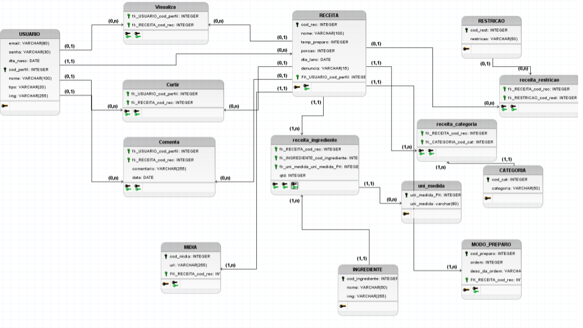

# TRABALHO DE PI:  Título do Trabalho
Trabalho desenvolvido durante a disciplina de Banco de Dados do Integrado

# Sumário

### 1. COMPONENTES 
Integrantes do grupo 
Halisson Julio Lopes:email_primeiro_componente@dominio.com 
Paulo Victor:paulovictoralves.contato@gmail.com 
Pedro Antônio:naosei@gmail.com 
Ricardo Leite Rodrigues:ricardoleiterodriguesbe@gmail.com 

### 2.MINIMUNDO 
Descrever o mini-mundo! (Não deve ser maior do que 30 linhas, se necessário resumir para justar)
Entrevista com o usuário e identificação dos requisitos.(quando for o caso de sistemas com cliente real)
Descrição textual das regras de negócio definidas como um subconjunto do mundo real cujos elementos são propriedades que desejamos incluir, processar, armazenar, gerenciar, atualizar, e que descrevem a proposta/solução a ser desenvolvida.
 

> O sistema proposto para a "Devcom Projetos conterá as informacões aqui detalhadas. Dos Projetos serão armazenados o número, nome e cidade. Dos Departamentos serão armazenados o número e nome. O cliente destacou que cada projeto pode ter vários departamentos auxiliando no seu desenvolvimento, e cada departamento pode estar envolvido em vários projetos. Os dados relativos aos empregados que serão armazenados são: rg, nome, cpf, salário, data inicial do salario e supervisor de cada empregado. É importante destacar que cada empregado pode ser supervisionado por outro empregado, e obrigatoriamente deve estar alocado a um único departamento, mas pode gerenciar vários departamentos ou não gerenciar nenhum. Um empregado também pode participar de vários projetos, caso seja necessário, mas não precisa obrigatoriamente estar alocado em algum projeto. Com relação aos dependentes serão armazenadas as informações de nome do dependente, data de nascimento, sexo e grau de parentesco. Cada empregado pode ter vários dependentes, mas um dependente esta associado apenas a um único empregado. Com relação ao histórico de salário devemos armazenar as informações de valor do salário, data de início do salário no período e data final do salário no período. É importante lembrar que cada funcionario pode ter diversos eventos de histórico de salário associados a ele visto que este dado pode ser alterado várias vezes..
 
 
### 3.PMC 

a) inclusão do PMC desenvolvido pelo grupo  

#### 3.1. EAP - Estrutura Analítica do Projeto
a) Incluír imagem da EAP   
b) Dicinário da EAP      

#### 3.2. Requisitos funcionais e não funcionais
  
     

#### 3.3 Validação da Ideia.
a) Link do formulário desenvolvido
b) Link para Relatório/Apresentação de resultados obtidos

### 4.Personas e Histórias de usuário 
  
a) inclusão dos Persons desenvolvidos pelo grupo 
 
  
b) inclusão das Histórias de usuário desenvolvidas pelo grupo
 

### 5. PROTÓTIPOS DO SISTEMA 
Neste ponto a codificação não e necessária, somente as ideias de telas devem ser desenvolvidas. O princípio aqui é pensar na criação da interface para identificar possíveis informações a serem armazenadas e/ou descartadas  

Sugestão: https://balsamiq.com/products/mockups/ 

#### 5.1 PROTÓTIPO DO SISTEMA MOBILE

#### 5.2 PROTÓTIPO DO SISTEMA WEB

#### 5.3 QUAIS PERGUNTAS PODEM SER RESPONDIDAS COM OS SISTEMA WEB/MOBILE PROPOSTOS?
    a) O sistema proposto poderá fornecer quais tipos de relatórios e informaçes? 
    b) Crie uma lista com os 5 principais relatórios que poderão ser obtidos por meio do sistema proposto!
    
> A Empresa Chef precisa inicialmente dos seguintes relatórios:
* Relatório de quais são as receitas mais bem avaliadas pelos usuários.
* Receitas com filtros escolhidos pelos usuários (pelas restrições ou pelas categorias).
* Relatório sobre o perfil do usuário (quantidade de usuários que ele segue ou tem de seguidores).
* Relátório sobre as receitas que o usuário enviou (quantas pessoas curtiram, quantas comentaram, quantas favoritaram).
* Relatório de quem são os usuários normais mais seguidos (caso um usuário tenha reeitas bem avaliadas ele vira um chef).

 ### 6.MODELO CONCEITUAL 
  

      
    
#### 7 Descrição dos dados   
PERFIL: Tabela que armazena as informações relativas ao peril 
cod_perfil: campo que armazena o número de registro do perfil no banco. 
nome: campo que armazena o nome do perfil. 
email: campo que armazena o email do perfil. 
senha: campo que armazena a senha do perfil. 
dta_nasc: campo que armazena a data de nascimento do perfil. 
tipo: campo que armazena o tipo do perfil. 

RECEITA: Tabela que armazenas as informações das receitas 
	cod_rec: campo que armazena o número de registro da receita no banco. 
	nome: campo que armazena o nome da receita. 
	temp_preparo: campo que armazena o tempo de preparo (em minutos) da receita. 
	porcao: campo que armazena a quantidade de pessoas que dá para alimentar. 
	dta_lanc: campo que armazena a data de lançamento da receita. 
	status: campo que fala se a receita foi aceita ou não. 

RESTRICAO: Tabela que armazenas as informações das restricoes 
	cod_rest: campo que armazena o número de registro da restição no banco. 
	restricao: informa qual a restrição 

CATEGORIA: Tabela que armazenas as informações das categorias 
	cod_cat: campo que armazena o número de registro da categoria no banco. 
	restricao: informa qual a categoria 

INGREDIENTE: Tabela que armazena as informações relativas aos ingredientes 
	cod_ingrediente: campo que armazena o número de registro do ingrediente no banco. 
	nome: informa qual é o ingrediente 

### 8	RASTREABILIDADE DOS ARTEFATOS 
        a) Historia de usuários vs protótipo (Histórias de Usuário e em qual tela do protótipo aquela HU está sendo realizada).
        b) Protótipo vs Modelo conceitual (Histórias de Usuário e em quais tabelas aquele dado está sendo registrado).
        (modelos devem obrigatoriamente estar em conformidade de rastreabilidade)

### 9	MODELO LÓGICO 

### 10	MODELO FÍSICO 
        a) inclusão das instruções de criacão das estruturas em SQL/DDL 
        (criação de tabelas, alterações, etc..) 
        
       
### 11	INSERT APLICADO NAS TABELAS DO BANCO DE DADOS 
        a) inclusão das instruções de inserção dos dados nas tabelas criadas pelo script de modelo físico
        (Drop para exclusão de tabelas + create definição de para tabelas e estruturas de dados 
   + insert para dados a serem inseridos)
        b) Criar um novo banco de dados para testar a restauracao 
        (em caso de falha na restauração o grupo não pontuará neste quesito)
        c) formato .SQL

#### 12 PRINCIPAIS CONSULTAS DO SISTEMA 
 Inserir as principais consultas (relativas aos 5 principais relatórios) definidas previamente no iten 3.1 deste template.
  
  a) Você deve apresentar as consultas em formato SQL para cad um dos relatórios.
  
  b) Além da consulta deve ser apresentada uma imagem com o resultado obtido para cada consulta. 

 ### 13 Gráficos, relatórios, integração com Linguagem de programação e outras solicitações. 
     OBS: Observe as instruções relacionadas a cada uma das atividades abaixo. 
 #### 13.1	Integração com Linguagem de programação;  
 #### 13.2	Desenvolvimento de gráficos/relatórios pertinentes, juntamente com demais  
 #### solicitações feitas pelo professor.  
 
 ### 14 Slides e Apresentação em vídeo.  
     OBS: Observe as instruções relacionadas a cada uma das atividades abaixo. 
 #### 14.1 Slides;  
 #### 14.2 Apresentação em vídeo  

    
##### About Formatting
    https://help.github.com/articles/about-writing-and-formatting-on-github/
    
##### Basic Formatting in Git
    
    https://help.github.com/articles/basic-writing-and-formatting-syntax/#referencing-issues-and-pull-requests
   
    
##### Working with advanced formatting
    https://help.github.com/articles/working-with-advanced-formatting/

#### Mastering Markdown
    https://guides.github.com/features/mastering-markdown/

### OBSERVAÇÕES IMPORTANTES

#### Todos os arquivos que fazem parte do projeto (Imagens, pdfs, arquivos fonte, etc..), devem estar presentes no GIT. Os arquivos do projeto vigente não devem ser armazenados em quaisquer outras plataformas.
1. Caso existam arquivos com conteúdos sigilosos, comunicar o professor que definirá em conjunto com o grupo a melhor forma de armazenamento do arquivo.

#### Todos os grupos deverão fazer Fork deste repositório e dar permissões administrativas ao usuário deste GIT, para acompanhamento do trabalho.

#### Os usuários criados no GIT devem possuir o nome de identificação do aluno (não serão aceitos nomes como Eu123, meuprojeto, pro456, etc). Em caso de dúvida comunicar o professor.

Link para BrModelo: 
http://sis4.com/brModelo/brModelo/download.html
 

Link para curso de GIT 

